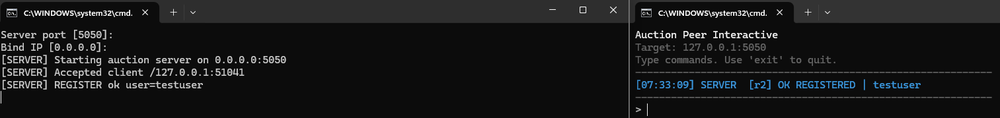
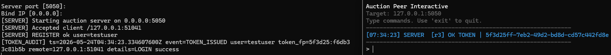
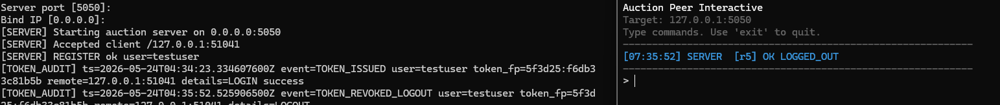
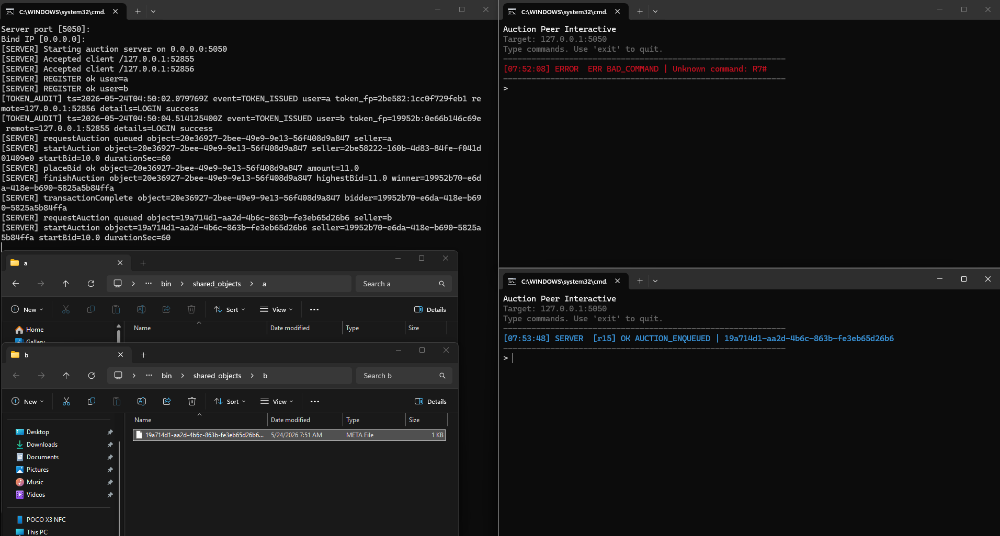
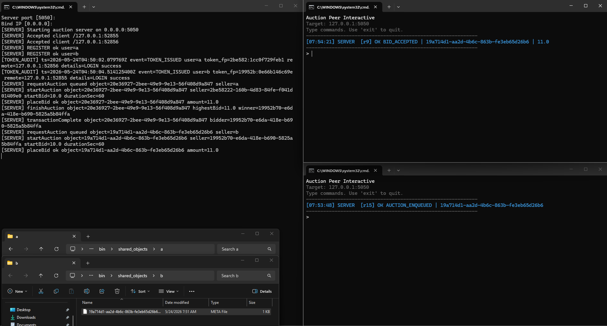
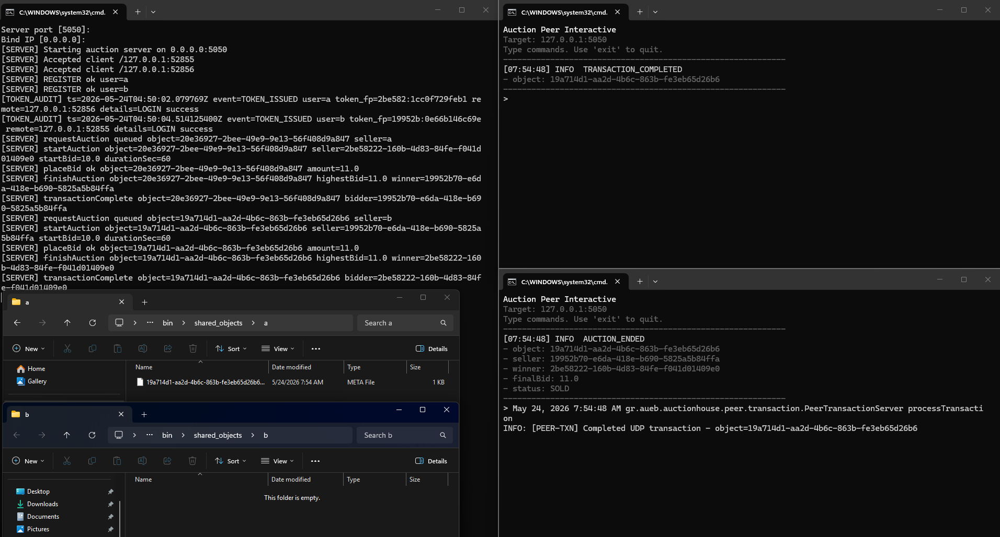
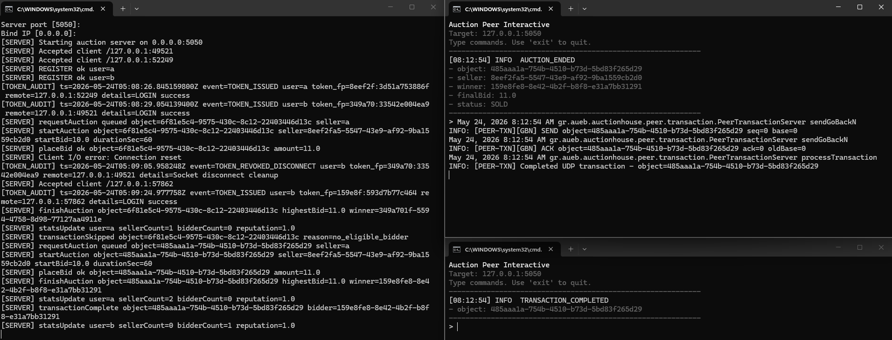
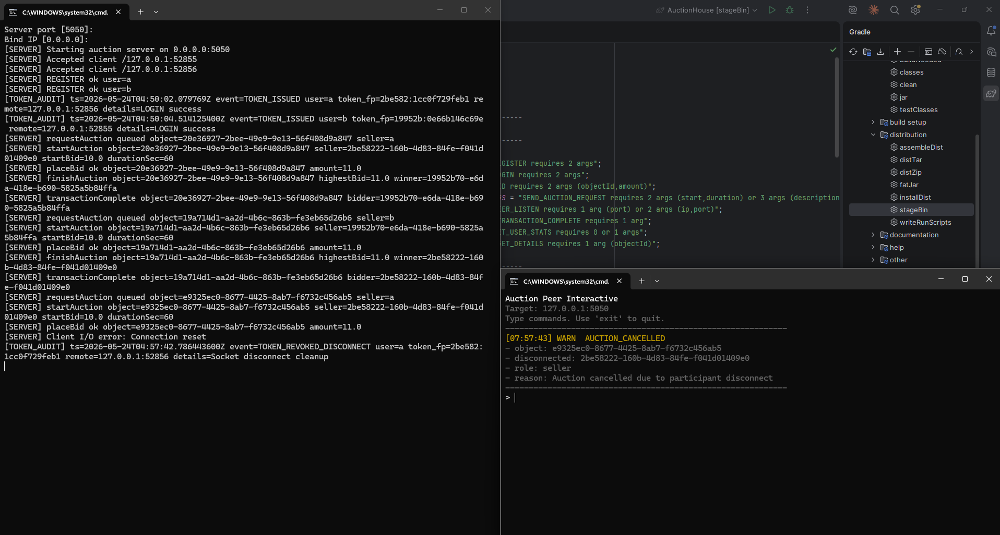
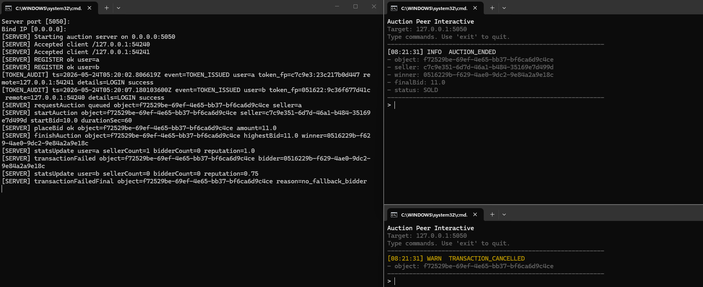

# Αναφορά Υλοποίησης - AuctionHouse

---

## 0. Buildchain & Εργαλεία

| Εργαλείο | Έκδοση                                           |
|---|--------------------------------------------------|
| JDK | OpenJDK 25 LTS, Temurin-25+36                    |
| Build tool | Gradle 9.5.0                                     |
| Project type | Gradle multi-module (`common`, `server`, `peer`) |

---

## 1. Σύνοψη

Η εφαρμογή είναι ένα **κατανεμημένο σύστημα δημοπρασιών σε πραγματικό χρόνο**. Αποτελείται από
έναν κεντρικό `Auction Server` και πολλούς `Peers`, οι οποίοι μπορούν να λειτουργούν είτε ως
πωλητές είτε ως αγοραστές.

### Υποστηριζόμενες λειτουργίες

- Εγγραφή και σύνδεση χρηστών
- Υποβολή αντικειμένων για δημοπρασία
- Έως **2 ενεργές δημοπρασίες ταυτόχρονα**
- Ταυτόχρονες συνδέσεις πολλών peers
- Υποβολή και έλεγχος bids
- Ενημέρωση peers με events σε πραγματικό χρόνο
- Peer-to-peer `transaction` μετά τη λήξη της δημοπρασίας
- Μεταφορά metadata αρχείου μέσω **UDP** με **Go-Back-N**
- Fallback ανάθεση σε επόμενο bidder όταν ο awarded bidder αποτυγχάνει ή ακυρώνει
- Ενημέρωση `reputation_score`, `num_auctions_seller`, `num_auctions_bidder`

### Βασική ροή

```text
Login -> PEER_LISTEN -> SEND_AUCTION_REQUEST -> [queue] -> Auction starts
-> BIDs -> Auction ends -> AWARDED / NO_WINNER -> Transaction -> Completion / Failure
```

---

## 2. Αρχιτεκτονική

### 2.1 Auction Server

Ο server είναι το κεντρικό κομμάτι του συστήματος. Λειτουργεί με **ένα thread ανά client** και
προστατεύει τα shared δεδομένα με locks και thread-safe δομές.

**Αρμοδιότητες:**

- Διαχείριση χρηστών και passwords
- Δημιουργία και ακύρωση session tokens
- Αποθήκευση active peer endpoints
- Διαχείριση ουράς δημοπρασιών
- Διατήρηση μέχρι **2 ενεργών δημοπρασιών**
- Επιλογή νέας δημοπρασίας με βάση το `reputation_score` των δύο πρώτων sellers στην ουρά
- Έλεγχος και αποδοχή bids
- Αποστολή events σε όλους τους peers
- Εκκίνηση transaction μετά τη λήξη
- Προώθηση σε fallback bidder όταν χρειάζεται
- Ενημέρωση στατιστικών και reputation

### 2.2 Peer / Bidder

Κάθε peer λειτουργεί τόσο ως **client** απέναντι στον server όσο και ως endpoint για peer-to-peer
συναλλαγές.

**Αρμοδιότητες:**

- Σύνδεση στον Auction Server
- `REGISTER`, `LOGIN`, `LOGOUT`
- Διαχείριση τοπικού `shared_directory`
- Δημιουργία ή χρήση metadata files
- Αποστολή `SEND_AUCTION_REQUEST`
- Παρακολούθηση ενεργών δημοπρασιών
- Υποβολή bids
- Εκτέλεση peer-to-peer transaction ως buyer ή seller

**Modes λειτουργίας:**

| Mode | Χρήση |
|---|---|
| `interactive` | Manual demo |
| `auto` | Automated testing με πολλούς peers |

### 2.3 Peer-to-Peer Transaction

Μετά τη λήξη της δημοπρασίας, ο buyer επικοινωνεί απευθείας με τον seller μέσω **UDP**.

Η μεταφορά του metadata file γίνεται με **Go-Back-N**, άρα:

- τα δεδομένα σπάνε σε πακέτα `64 bytes`
- το window size είναι `N = 3`
- κάθε πακέτο έχει sequence number
- ο buyer στέλνει cumulative ACKs
- αν λήξει timeout `2 sec`, ο seller επαναμεταδίδει από το παλαιότερο μη επιβεβαιωμένο πακέτο

> Σημείωση: Σε LAN λειτουργεί κανονικά. Σε public internet απαιτείται port forwarding ή VPN,
> επειδή δεν υπάρχει NAT traversal.

---

## 3. Δομή Project

```text
AuctionHouse/
|-- common/          # Models, protocol, parsing, enums, message types
|-- server/          # Server logic & handlers
|-- peer/            # Peer client & transaction logic
|-- bin/             # Compiled binaries & run scripts
|-- screenshots/     # Screenshots για την αναφορά
|-- build.gradle
|-- settings.gradle
`-- REPORT.md
```

### 3.1 common

- Models για auctions
- Protocol builders
- Parsing / encoding utilities
- Enums για commands, events, errors
- Message representations

### 3.2 server

| Κλάση | Ρόλος |
|---|---|
| `ServerMain` | Entry point |
| `AuctionServer` | Lifecycle & socket accept loop |
| `ClientHandler` | Per-client thread |
| `CommandProcessor` | Command dispatch |
| `AuctionEngine` | Auction state machine |
| `ServerState` | Shared mutable state |

### 3.3 peer

- `PeerMain`, `AuctionPeer`
- Interactive & auto sessions
- Command parsing / sending
- Live event tracking
- Transaction logic
- Console UI

---

## 4. Protocol

Όλα τα μηνύματα είναι plain text, `\n`-terminated, με `|` ως delimiter.

```text
COMMAND|arg1|arg2
OK|code|field1|field2
ERR|error_code|message
EVENT|event_type|field1|field2
```

Για request correlation:

```text
requestId#COMMAND|...
requestId#OK|...
requestId#ERR|...
```

> Τα events δεν φέρουν request ID.

---

## 5. Commands

### Guest (unauthenticated)

| Command | Περιγραφή |
|---|---|
| `PING` | Liveness check |
| `HELLO` | Handshake |
| `REGISTER|username|password` | Εγγραφή νέου χρήστη |
| `LOGIN|username|password` | Σύνδεση |

### Authenticated

| Command | Περιγραφή |
|---|---|
| `LOGOUT` | Αποσύνδεση |
| `SEND_AUCTION_REQUEST|description|startPrice|durationSec` | Υποβολή αντικειμένου |
| `SEND_AUCTION_REQUEST|--meta|objectId` | Επαναχρησιμοποίηση υπάρχοντος metadata |
| `GET_CURRENT_AUCTION` | Επιστρέφει σύνοψη των ενεργών δημοπρασιών |
| `GET_DETAILS|objectId` | Πλήρεις λεπτομέρειες για συγκεκριμένο active object |
| `BID|objectId|amount` | Υποβολή προσφοράς |
| `GET_USER_STATS|[username]` | Στατιστικά χρήστη |
| `PEER_LISTEN|ip|port` | Δήλωση endpoint |
| `TRANSACTION_COMPLETE|objectId` | Επιβεβαίωση επιτυχούς transaction |
| `TRANSACTION_FAILED|objectId` | Δήλωση αποτυχίας / ακύρωσης transaction |

---

## 6. Βασικές Ροές

### Register

```text
-> REGISTER|peer01|pw
<- OK|REGISTERED|peer01
```

### Login

```text
-> LOGIN|peer01|pw
<- OK|TOKEN|<token>
-> PEER_LISTEN|<ip>|<port>
```

### Auction Request

```text
-> SEND_AUCTION_REQUEST|demo item|20.0|60
   ή
-> SEND_AUCTION_REQUEST|--meta|objectId
```

### Bid

```text
-> BID|objectId|25.0
<- OK|BID_ACCEPTED|objectId|25.0
```

### Πληροφορίες ενεργών δημοπρασιών

```text
-> GET_CURRENT_AUCTION
-> GET_DETAILS|objectId
```

---

## 7. Events

| Event | Περιγραφή |
|---|---|
| `EVENT|AUCTION_QUEUED|...` | Το αντικείμενο μπήκε στην ουρά |
| `EVENT|AUCTION_STARTED|...` | Έναρξη δημοπρασίας |
| `EVENT|BID_ACCEPTED|...` | Αποδοχή bid |
| `EVENT|AUCTION_ENDED|...` | Λήξη δημοπρασίας |
| `EVENT|AUCTION_CANCELLED|...` | Ακύρωση δημοπρασίας |
| `EVENT|TRANSACTION_READY|...` | Ο winner πρέπει να ξεκινήσει transaction |
| `EVENT|TRANSACTION_PROMOTED|...` | Προώθηση στον επόμενο bidder |
| `EVENT|TRANSACTION_COMPLETED|...` | Επιτυχής ολοκλήρωση |
| `EVENT|TRANSACTION_FAILED|...` | Οριστική αποτυχία |

### Κατάσταση λήξης δημοπρασίας

Στο `AUCTION_ENDED`:

- `AWARDED` σημαίνει ότι υπάρχει επιλέξιμος bidder και εκκρεμεί transaction
- `NO_WINNER` σημαίνει ότι η δημοπρασία έληξε χωρίς επιλέξιμο bidder

Το αντικείμενο θεωρείται πραγματικά πωλημένο μόνο μετά από `TRANSACTION_COMPLETED`.

---

## 8. Transaction Protocol

Η peer-to-peer επικοινωνία μετά τη λήξη γίνεται πλέον με UDP και Go-Back-N.

### Βασικά χαρακτηριστικά

- UDP transport
- πακέτα `64 bytes`
- `window size = 3`
- cumulative ACKs
- `timeout = 2 sec`
- retransmission σε timeout

### Προσομοίωση αναξιόπιστου δικτύου

Από πλευράς buyer:

- drop εισερχόμενου data packet με πιθανότητα `20%`
- αποστολή νέου ACK με πιθανότητα `80%`

### Πιθανότητα ακύρωσης winner

Ο highest / awarded bidder:

- προχωρά σε transaction με πιθανότητα `70%`
- ακυρώνει με πιθανότητα `30%`

Σε ακύρωση:

- ο server μειώνει το `reputation_score`
- δοκιμάζει fallback bidder
- αν δεν υπάρχει fallback bidder, η transaction αποτυγχάνει οριστικά

---

## 9. Εκτέλεση

### Build

```powershell
.\gradlew.bat build
```

### Stage binaries

```powershell
.\gradlew.bat stageBin
```

### Εκκίνηση Server

```powershell
bin\run-server.bat
```

### Εκκίνηση Peer

```powershell
bin\run-peer.bat
```

### Shared directory

```text
bin/shared_objects/<username>/
```

---

## 10. Προβλήματα & Λύσεις

### Ταυτόχρονα events και responses

Από το ίδιο socket φτάνουν τόσο απαντήσεις σε commands όσο και asynchronous events. Π.χ. ενώ
ένας peer περιμένει απάντηση σε `BID`, μπορεί να φτάσει πρώτα `EVENT|BID_ACCEPTED`.

**Λύση:** Διαχωρισμός responses και events σε ξεχωριστές queues.

---

### Race conditions στα bids

Πολλοί peers που κάνουν bid σχεδόν ταυτόχρονα μπορούν να διαβάσουν την ίδια παλιά τιμή.

**Λύση:** Atomic state update και server-side locking για κάθε bid.

---

### Λήξη δημοπρασίας και late bids

Υπήρχε race condition μεταξύ λήξης της δημοπρασίας και άφιξης νέου bid.

**Λύση:** Έλεγχος `remaining time` πριν από κάθε αποδοχή bid.

---

### Session identity μετά από reconnect

Υπήρχε περίπτωση bidder να αποσυνδεθεί και να ξανασυνδεθεί, αλλά η λογική fallback /
transaction να κρατάει παλιό token session.

**Λύση:** Ευθυγράμμιση της eligibility λογικής με την τρέχουσα identity του χρήστη ώστε να
μην εμφανίζεται ασυνέπεια τύπου `winner` αλλά `no_eligible_bidder`.

---

### Κατάσταση `SOLD` έναντι `AWARDED`

Αρχικά η εφαρμογή εμφάνιζε `SOLD` αμέσως με τη λήξη της δημοπρασίας, κάτι που ήταν λογικά
λανθασμένο όταν το transaction δεν είχε ακόμη ολοκληρωθεί.

**Λύση:** Στο `AUCTION_ENDED` η κατάσταση είναι πλέον:

- `AWARDED` όταν υπάρχει επιλέξιμος bidder
- `NO_WINNER` όταν δεν υπάρχει επιλέξιμος bidder

Το τελικό success φαίνεται από το `TRANSACTION_COMPLETED`.

---

### Αποσύνδεση seller

Αν ο seller αποσυνδεθεί κατά τη διάρκεια ενεργής δημοπρασίας, απαιτείται άμεση ακύρωση.

**Λύση:** Cleanup του session, αφαίρεση active endpoint, αποστολή `EVENT|AUCTION_CANCELLED`
σε όλους.

---

### Λάθος advertised IP

Σε tests μεταξύ διαφορετικών μηχανημάτων, το `127.0.0.1` δεν είναι επαρκές για P2P
transactions.

**Λύση:** Υποστήριξη explicit advertised IP και χρήση του δηλωμένου peer endpoint.

---

### Metadata duplication

Με `--meta`, η χρήση υπάρχοντος αντικειμένου μπορούσε να δημιουργήσει δεύτερο metadata file.

**Λύση:** Το flow ελέγχει αν υπάρχει ήδη το file και το επαναχρησιμοποιεί.

---

### Καθαρισμός metadata μετά τη συναλλαγή

Απαιτείται το metadata να υπάρχει στον buyer και να αφαιρείται από τον seller σωστά.

**Λύση:** Ξεχωριστό transaction flow με επιβεβαίωση προς τον server (`TRANSACTION_COMPLETE`).

---

### Console rendering

Στο interactive mode, live auction updates και user input μπορούσαν να ανακατευτούν.

**Λύση:** Ξεχωριστός live tracker / formatter.

---

### Command delimiter

Στην υλοποίηση χρησιμοποιείται `|` ως delimiter μεταξύ πεδίων, π.χ.:

```text
SEND_AUCTION_REQUEST|description|startPrice|durationSec
```

Αυτό εξασφαλίζει καθαρό parsing ακόμη και σε descriptions με κενά.

---

## 11. Screenshots

### Εγγραφή peer


### Σύνδεση peer


### Αποσύνδεση peer


### Enqueue δημοπρασίας


### Αποδοχή bid


### Λήξη δημοπρασίας / ανάθεση


### Επιτυχής ολοκλήρωση συναλλαγής


### Ακύρωση δημοπρασίας / αποτυχία ροής


### Μείωση reputation

---

## 12. Γνωστά Security Gaps

> Το σύστημα είναι σχεδιασμένο για ακαδημαϊκή χρήση σε controlled περιβάλλον. Η παρακάτω λίστα
> καταγράφει γνωστά κενά ασφαλείας που δεν αντιμετωπίζονται στην τρέχουσα υλοποίηση. Το σύστημα
> δεν είναι production-ready.

### Transport & Encryption

Δεν υπάρχει TLS στην επικοινωνία client-server ούτε στο peer-to-peer transaction channel. Άρα
passwords, session tokens και metadata μεταφέρονται plaintext.

### Authentication & Session Management

| # | Gap |
|---|---|
| 1 | Δεν υπάρχει account lockout ή brute-force protection |
| 2 | Δεν υπάρχει replay protection |
| 3 | Δεν υπάρχει HMAC / message authentication |
| 4 | Δεν υπάρχει token theft protection |
| 5 | Δεν υπάρχει username enumeration protection |
| 6 | Δεν υπάρχει ισχυρή πολιτική κωδικών / rotation |

### Peer Identity & P2P Security

| # | Gap |
|---|---|
| 7 | Δεν υπάρχει ισχυρή peer identity verification στο P2P |
| 8 | Δεν υπάρχει πλήρης validation ότι το advertised peer IP ανήκει πράγματι στον peer |
| 9 | Υπάρχει ευαισθησία σε spoofing αν διαρρεύσει token |

### Authorization & Access Control

| # | Gap |
|---|---|
| 10 | Δεν υπάρχει role-based authorization πέρα από το τρέχον session context |
| 11 | Δεν υπάρχει persistent audit backend ή tamper-evident logging |

---
